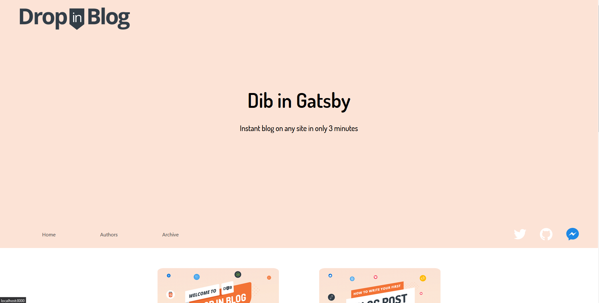

# dib-gatsby-starter

<p class="text-center">
 
</p>

A Gatsby plugin for creating blogs from the headless [DropInBlog CMS](https://dropinblog.com/) 🚀.

## Demo

Check out our live [Demo](https://dropinblog-gatsby-starter.netlify.app/) on Netlify to check out how fancy it is.

<p class="text-center">
 
</p>

## Requirements

First you'll need to [create an account](https://dropinblog.com/signup/?plan=6) to pull data from, after that try creating some placeholder posts to make sure things are working later.

## Getting Started

If you have NPM or Yarn, you can clone the repo.

```terminal
$ git clone https://github.com/DynamisDevelopment/$ dib-gatsby-starter.git
$ yarn install
```

Or use the Gatsby CLI.

```terminal
$ gatsby new dropinblog-starter https://github.com/DynamisDevelopment/dib-gatsby-starter.git
```

When that's done all you need to connect to your account is to create a `.env` file to store your account ID as DIB_KEY.

```env
DIB_KEY=ZG3GBQ33PE6KL62J983s
```

(Not a real key, don't even try 😉)

With that, all of your data should be available to inspect in GraphiQL or GraphQL Playground, happy coding.

## Essential Commands

### `yarn dev`

Run the site locally.

### `yarn build`

Build the production version of the site, I recommend starting out with [Netlify](https://www.netlify.com/).

### `yarn serve`

Run the built version of the site, just remember to run `yarn build` first.

### `yarn clean`

If you have any problems getting new data to update or any other abnormal behavior, this will clear Gatsby's cache and recompile/refetch everything from scratch.

## How It Works (Advanced)

For the mean time, `dib-starter` relies on the [gatsby-source-custom-api](https://www.gatsbyjs.org/packages/gatsby-source-custom-api/) to fetch the data from our REST API. This is obviously not optimal and a custom source plugin is currently in the works.

But until then it may be helpful to understand exactly how we're manipulating the data in `gatsby-node.js` in case you have any problems or want to make any pull requests, which I'll happily accept 😃.

DropInBlog was originally designed for using our snippets which fetch an array of data and render each post in it. The problem is that GraphQL gives us some nice tools, like `filter`, but since it's not getting many items to loop through but a single array of many items, those features aren't available.

As far as you just want to dump everything to the screen, that works fine, but if you need to do something like filter down to only the posts by a single author, then you have a major problem.

To get around this I have taken the liberty of using the [createSchemaCustomization](https://www.gatsbyjs.org/docs/schema-customization/) and [onCreateNote](https://www.gatsbyjs.org/docs/node-apis/#onCreateNode) APIs completely remap the `data` array into something more GraphQL friendly.
